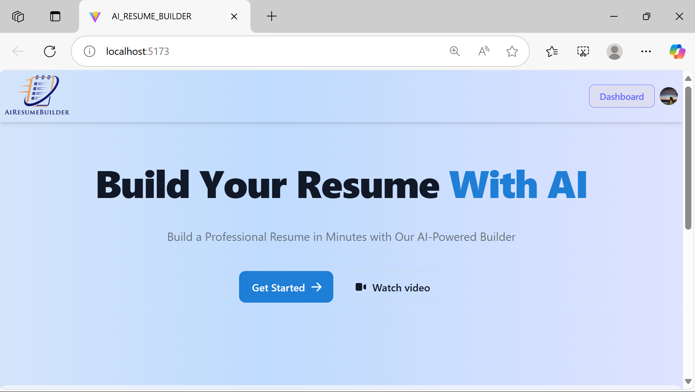

<h1 align="center">🚀 AI Resume Builder 📋</h1>

  <b>Smart, AI-powered resume creation tool built with React, Strapi, PostgreSQL & Gemini API.</b> 
  <i>Empowering job seekers with intelligent, real-time, and professional resume building.</i>

  
  
  
  
  

 

<i>Preview of the AI Resume Builder Homepage</i>

---

## 🧠 Project Overview

**AI Resume Builder** is a full-stack application that allows users to generate job-optimized, AI-enhanced resumes with real-time suggestions and skill recommendations. It integrates AI via Gemini API and supports authentication, editing, and PDF export — all from an intuitive user interface.

---

## 👥 Team Members & Roles

### 👩‍💻 Kazi Namira Meyheg Sanam (ID: C231450) – *Frontend Developer*
- Set up frontend using React.js, Vite & Tailwind CSS  
- Designed responsive layout with dynamic form components  
- Integrated Clerk authentication  
- Developed PDF export feature  
- Integrated backend APIs  

### 👩‍💻 Umme Benin Yeasmin Meem (ID: C231452) – *Backend Developer*
- Set up backend using Strapi CMS  
- Configured PostgreSQL via Neon.tech  
- Integrated Gemini API for AI-driven suggestions  
- Created secure APIs for resume data  
- Managed authentication and skill suggestion logic  

---

## 🎯 Project Objective

To build a smart and interactive resume builder that:
- Uses AI to enhance resume quality  
- Offers role-based skill recommendations  
- Provides a beautiful, downloadable PDF resume  
- Simplifies the resume creation process for users  

---

## ✨ Features

- 🔐 Secure user authentication via Clerk  
- 📝 Dynamic and editable resume forms  
- 🤖 AI-powered suggestions using Gemini API  
- ⚡ Real-time feedback and enhancements  
- 📥 PDF export functionality  
- 💡 Skill and content recommendations  
- 📱 Fully responsive, mobile-friendly interface  

---

## 🛠️ Tech Stack

### 🎯 Frontend
- 🚀 **React.js** – Component-based UI  
- ⚡ **Vite** – Lightning-fast frontend tooling  
- 🎨 **Tailwind CSS** – Modern styling framework  

### 🧩 Backend
- 🛠 **Node.js + Express.js** – Server environment  
- 📜 **Strapi CMS** – API and content management system  

### 🗃️ Database
- 🐘 **PostgreSQL** – Relational data storage  
- ☁️ **Neon.tech** – Cloud-hosted PostgreSQL solution  

### 🤖 AI Integration
- 🤖 **Gemini API** – For content generation & resume scoring  
- 🧠 NLP Models – For skill matching & suggestions  

---

## 📌 Deployment *(Planned)*

- 🌍 **Vercel** – Planned platform to host the frontend (React + Vite)  
- 🔧 **Render** – Planned platform to deploy the backend (Strapi CMS)  

> 🛠️ *Currently, both frontend and backend run locally. Cloud deployment is scheduled in the next phase.*

---

## 🚧 Development Roadmap

📍 **Phase 1** – Project structure & frontend setup  
✅ *Completed by Kazi Namira Meyheg Sanam*

📍 **Phase 2** – Core frontend components  
✅ *Completed by Kazi Namira Meyheg Sanam*

📍 **Phase 3** – Backend setup with Strapi CMS  
✅ *Completed by Umme Benin Yeasmin Meem*

📍 **Phase 4** – PostgreSQL database on Neon.tech  
✅ *Completed by Umme Benin Yeasmin Meem*

📍 **Phase 5** – Frontend-backend integration  
✅ *Completed collaboratively*

📍 **Phase 6** – Resume form logic & Gemini AI integration  
✅ *Completed by Umme Benin Yeasmin Meem*

📍 **Phase 7** – Real-time suggestions & PDF export  
✅ *Fully integrated and functional*

📍 **Phase 8** – Final testing, documentation, and polish  
✅ *Project completed successfully*

---

## 📬 Contact

For feedback or collaboration:

- 🎨 **Frontend**: Kazi Namira Meyheg Sanam  
- 🧠 **Backend**: Umme Benin Yeasmin Meem

 <i>Built with using React, Strapi, PostgreSQL, and AI — to shape the future of resume building.</i> 

---
